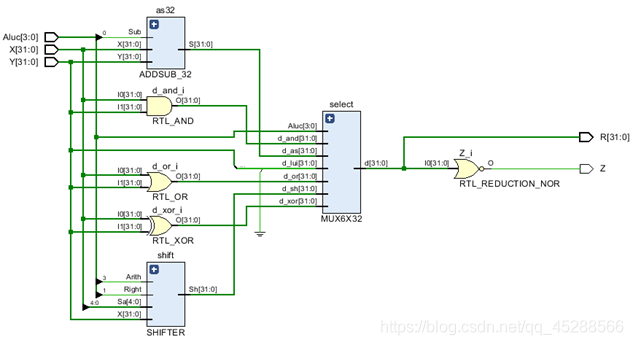
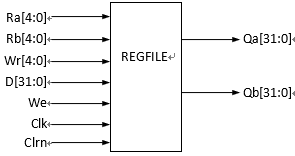
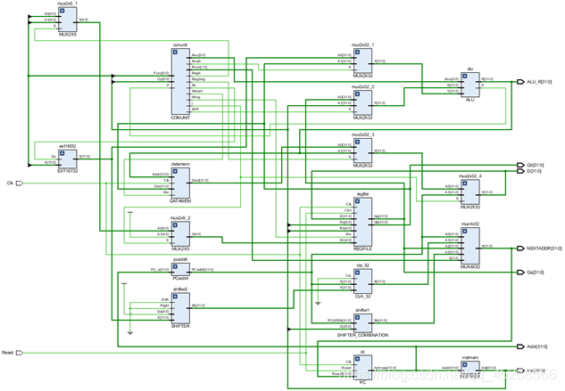
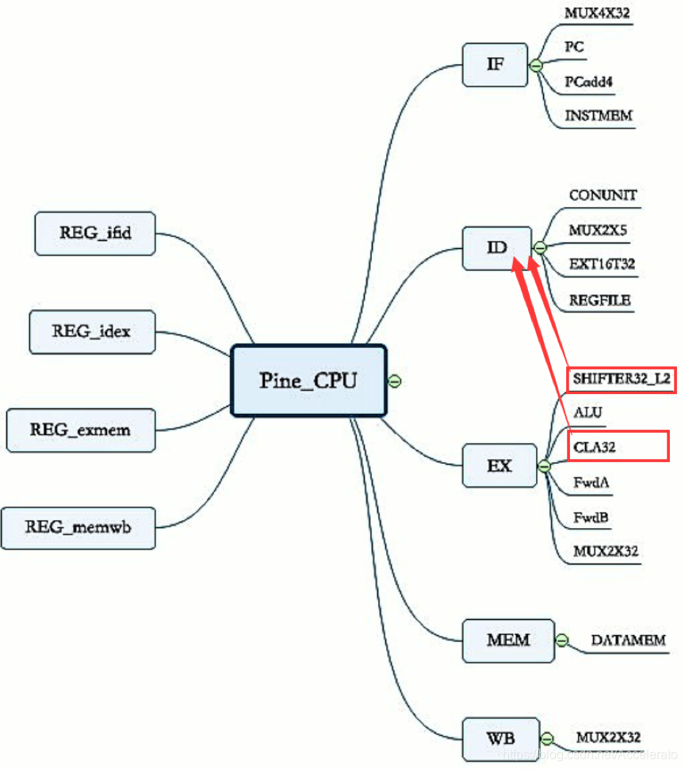

# MIPS32-CPU

 Verilog implements Single-cycle and Pipelined CPUs which can execute 20 instructions.
 
 Files:
 - [`Single-Cycle CPU`](#d_CPU): files which is Single-cycle CPU.
 - [`Pipelined CPU`](#L_CPU): files which is Pipelined CPU.
 
 ## Single-Cycle CPU
 
 Single-cycle CPU implements by ALU (arithmetic unit), controller, register file, instruction fetch components and other basic functional components. 
 
 - [Basic Components](#Basic_Components)
 - [ALU](#ALU)
 - [REGFILE](#REGFILE)
 - [Conunit](#Conunit)
 - [Instruction Memory](#Instruction_Memory)
 - [CPU Packaging](#CPU_Packaging)
 
 ### Basic Components
 
 Basic function components are below:
- 32-bit 2-to-1 Selector
- 32-bit 4-to-1 selector
-  5-bit 2-to-1 selector
- 16-bit-32-bit expander
- of 32-bit shifter
- of 26-32 Bit Shifter
- 32-bit adder/subtractor

### ALU

The arithmetic unit ALU is one of the core components of the CPU. There are two main methods for its implementation: one is based on the adder and is implemented by changing the carry function; the other is implemented by parallel multiplexing of the arithmetic components. In the implementation of ALU, a 32-bit adder/subtractor, a 32-bit shifter, and a 32-bit 6-to-1 selector are used.

### REGFILE

A 32×32 register group will be constructed for REGFILE, that is, there are 32 registers in total, and the bit width of each register is 32 bits.

### Conunit

In the Verilog implementation code of the controller, the function of the instruction is first decoded, and the variable starting with "i_" represents the function of the batch order. Then the corresponding control signal is generated according to the function of the instruction.

### Instruction Memory

Do not use IP core design instruction memory, directly use general code to achieve.

### CPU Packaging

The basic principle of CPU packaging is to connect various functional components according to the overall circuit diagram of a single-cycle CPU.

## Pipelined CPU

In order to run the entire CPU, a top-level module (MAIN) needs to be added to call these modules.

# Author

- Zijie Tang
- zijietang0316@gmail.com
- [GitHub](https://github.com/zijietang0316)
- [LinkedIn](https://www.linkedin.com/in/zijie-tang-4ba81b240/)
